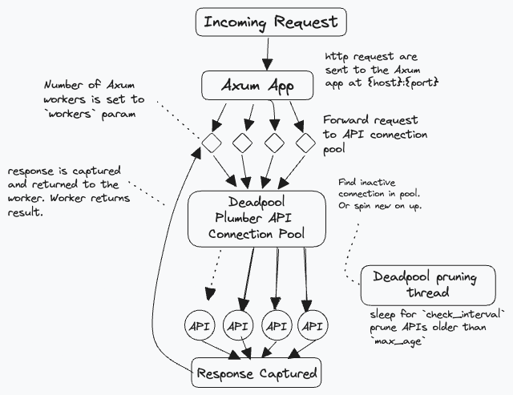

# Valve

> _Redirects your plumbing for you._


Watch the video! 


`valve` creates multi-threaded [Plumber APIs](https://www.rplumber.io/) powered by Rust's [tokio](https://github.com/tokio-rs/tokio) and [axum](https://github.com/tokio-rs/axum) web frameworks. Plumber connections are automatically spawned, pooled, and terminated using [deadpool](https://docs.rs/deadpool/). App connections are automatically pooled by [hyper](https://docs.rs/hyper/latest/hyper/client/index.html).

Valve is a Rust CLI with an accompanying R package. Running Valve from an R session will block the session. If you are comfortable, it is recommended to install the cli so you can run Valve from your terminal so that you can call the plumber APIs from your R session.

## Motivation

Plumber is an R package that creates RESTful APIs from R functions. It is limited in that each API is a single R process and thus a single thread. Multiple queries are executed in the sequence that they came in. Scaling plumber APIs is not easy. The intention of valve is to be able to make scaling plumber APIs, and thus R itself, easier. We can make R better by leveraging Rust's ["fearless concurrency."](https://blog.rust-lang.org/2015/04/10/Fearless-Concurrency.html)


## Installation

### Cli Instructions
To install the executable only run

```bash
cargo install valve-rs --no-default-features
```
### R package instructions

There is an R package to simplify the use of Valve for those who are not familiar with Rust or CLI tools. It is available as a binary for Windows, Linux, and MacOSX thanks to [R-universe](https://r-universe.dev/).

```r
install.packages("valve", repos = c("https://josiahparry.r-universe.dev", "https://cloud.r-project.org"))
```

When the R package is built it also includes the binary executable at `inst/valve`. So if you ever find yourself needing the executable `system.file("valve", package = "valve")` will point you right to it! This will always be the version of the executable that your R package is using.

You can verify the binary works for your machine by running the below. If you have a Windows machine include `system.file("valve.exe", package = "valve")` for the executable. 

```r
# get executable path and included api paths
valve_executable <- system.file("valve", package = "valve")
plumber_api_path <- system.file("plumber.R", package = "valve")

# check that they exist
file.exists(c(valve_executable, plumber_api_path))

# run Valve from the R-package's executable
processx::run(
  valve_executable,
  args = c("-f", plumber_api_path),
  echo = TRUE
)
```


## Creating a Valve app

To run a plumber API concurrently using the R package, use `valve_run()`. The most important argument is `filepath` which determines which Plumber API will be executed as well as specifying the `host` and `port` to determine _where_ your app will run. Additional configuration can be done with the `n_max`, `workers`, `check_unused`, and `max_age` argument to specify _how_ your app will scale. By default, the app will be run on host `127.0.0.1` and on port `3000`.

```r
library(valve)
# get included plumber API path
plumber_api_path <- system.file("plumber.R", package = "valve")

valve_run(plumber_api_path, n_max = 5)
#> Docs hosted at <http://127.0.0.1:3000/__docs__/>
```

Using the cli:

```shell
valve -f plumber.R -n 5 
```

### Understanding the parameters: 

The arguments that you provide determines how Valve will scale up and down the application is requests come in. 

- `host` (`--host`): 
  - defaults to `127.0.0.1`. Defines which host the Axum app and the plumber API will be hosted on.
- `port` (`--port`): 
  - defaults to `3000`. Defines which port the main Axum app will be listening on.
- `file` (`--file`): 
  - defaults to `plumber.R`. The path to the R script that defines the plumber API.
- `workers` (`--workers`): 
  - default `3`. Determines how many workers are set in the [Tokio `Runtime`](https://docs.rs/tokio/latest/tokio/runtime/struct.Builder.html#method.worker_threads). These workers handle incoming requests and return responses. 
- `n_max` (`--n-max`): 
  - default `3`. Refers to the maximum number of background Plumber APIs that can be spawned whereas `workers` specifies how many main worker threads are available to handle incoming requests. Generally, the number of `workers` should be equal to the number of plumber APIs since because plumber is single threaded. This is the default. If `workers` is less than `n_max`, you'll never spawn the maximum number of APIs.
- `check_unused` (`--check-unused`): 
  - default `10`. The time interval, in seconds, to check for unused connections.
- `max_age` (`--max-age`):
  - default `300` (five minutes). Specifies how long a connection can go unused without being terminated. If a connection reaches this age it will be terminated in the next pool check (interval determined by check_unused).
- `n_min`: 
  - default `1`. The minimum number of connections to keep active at all times. Connections will not be pruned if there are this many connections open.


<!--
## How it all works

By default, valve creates an app hosted at  `127.0.0.1:3000`. 
It looks for a file called `plumber.R` in the working directory. 

The app that is spun up has 3 Axum workers (`workers`) which handle the incoming requests. 
The app also will create a pool of `n-max` plumber APIs which too is set to 3. 
The number of workers and the maximum number of plumber APIs should, generally,
be the same. If there are more workers than API connections, then there will be 
a worker waiting for a plumber API connection to free up before it can be used. 
-->

## Example: Calling valve with multiple workers

The way valve works is by accepting requests on a main port (3000 by default) and then distributing the requests round robin to the plumber APIs that are spawned on random ports. Requests are captured by `axum` and proxied to a plumber API process.

You can run the example plumber API included with Valve in the background in R using this code chunk:

```r
# create temp file
tmp <- tempfile(fileext = ".R")

# create script lines
valve_script <- '
plumber_api_path <- system.file("plumber.R", package = "valve")
valve::valve_run(plumber_api_path, workers = 5)
'
# write to temp
writeLines(valve_script, tmp)

# run in the background
rstudioapi::jobRunScript(tmp)
```

Or launch it directly from the terminal via: 

```shell
valve -f $(Rscript -e 'cat(system.file("plumber.R", package = "valve"))')
```

Once the Valve app is running in the background we can begin the example. First I'm going to define a function to call the `/sleep` endpoint. The function will take two parameters: the port and the duration of sleep. The port will be used to change between the valve app and a single plumber API.


```r
sleep <- function(port, secs) {
  httr2::request(
        paste0("127.0.0.1:", port, "/sleep?zzz=", secs)
    ) |> 
    httr2::req_perform() |> 
    httr2::resp_body_string()
}
```

Using this function we'll create 5 total R sessions each will make a request to sleep for 2 seconds.

``` r
library(furrr)
plan(multisession, workers = 5)
```

First, we'll ping the main valve app which will distribute requests. The first time
this is ran might be slow since there will not be any plumber APIs in the pool yet.

```r
start <- Sys.time()
multi_sleep <- future_map(1:5, ~ sleep(3000, 2))
multi_total <- Sys.time() - start
```

Next, we select only one of the available plumber APIs and query it. 

```r
start <- Sys.time()
single_sleep <- furrr::future_map(1:5, ~ sleep(53869, 2))
single_total <- Sys.time() - start
```
Notice the performance difference. 

```r
print(paste0("Multiple Plumber APIs: ", round(multi_total, 2)))
#> [1] "Multiple Plumber APIs: 2.63"
print(paste0("One Plumber API: ", round(single_total, 2)))
#> [1] "One Plumber API: 10.08"
```

In the former each worker gets to make the request in approximately the same amount of time. The latter has to wait for each subsequent step to finish before the next one can occur. So we've effectively distributed the work load. 

## How Valve Works

The architecture, at a high level, is captured by this diagram. 



There are really three key components to this: 

- the Tokio `Runtime`,
- the Axum `Router`, 
- and the connection `Pool`.  

### Request handling

The tokio [`Runtime`](https://docs.rs/tokio/latest/tokio/runtime/struct.Runtime.html) is what allows Valve to be asynchronous. It handles I/O, tasks, and all that jazz. It is also what backs `Axum`. In Valve, we [define an asynchronous runtime](https://github.com/JosiahParry/valve/blob/aeebc19e868d39014419129fa07da42cc9113ee7/src/rust/src/lib.rs#L23) with a pre-defined number of `workers`. These workers are what handle the incoming requests. 

When a request is picked up, it is then sent to the Axum [`Router`](https://docs.rs/axum/latest/axum/struct.Router.html). The router takes the incoming requests and sends them to the appropriate endpoint. 

The routes that are defined are `/` and `/*key`. `/` is a permanent redirect to the plumber API documentation. Whereas `/*key` captures every other request. These requests have a special handler that, in short, act as a reverse proxy between Axum and a plumber API. The handler captures the request and grabs a Plumber connection from the [`Pool`](https://docs.rs/deadpool/latest/deadpool/managed/struct.Pool.html). The [Plumber struct](https://github.com/JosiahParry/valve/blob/aeebc19e868d39014419129fa07da42cc9113ee7/src/rust/src/plumber.rs#L24) contains the host and port that the APIs live on. The request is then parsed, and redirected to the plumber API. The [response is captured and returned as a response](https://github.com/JosiahParry/valve/blob/aeebc19e868d39014419129fa07da42cc9113ee7/src/rust/src/plumber.rs#L74) to the Axum router.


### Connection pooling

Valve implements a custom [managed](https://docs.rs/deadpool/latest/deadpool/managed/index.html) Pool for plumber APIs. The pool consists of `Plumber` struct which contain the host, port, and the [child process](https://doc.rust-lang.org/std/process/struct.Child.html). 

When Deadpool spawns a new connection for the pool, it thus spawns a new plumber API. This is done using [`Command::new()`](https://doc.rust-lang.org/std/process/struct.Command.html) to create a detached child process. A random port is generated, checked, and then assigned to the plumber API. Then the process is started by calling `R -e "plumber::plumb('{filepath}')$run(host = '{host}', port = {port})"` via `Command`. This means that _R must be on the path_ and that if there are multiple installs of R, whichever one is on the path will be used.

To prevent plumber APIs being spawned too frequently they are kept alive for duration defined by `max_age`. A connection can be unused for that duration. If it exceeds that age without being used, Deadpool will prune the connection and terminate the process. This check happens on a [separate thread](https://github.com/JosiahParry/valve/blob/aeebc19e868d39014419129fa07da42cc9113ee7/src/rust/src/start.rs#L56C4-L56C4) occurring every `check_unused` seconds. 


## Benchmarks with drill

Simple benchmarks using drill can be found in `inst/bench-sleep-plumber.yml` and `bench-sleep-valve.yml`. 

The bench mark calls the `/sleep` endpoint and sleeps for 500ms for 100 times with 5 concurrent threads. This alone can illustrate how much we can speed up a single plumber API's response time with valve.

Plumber's benchmark:

```
Time taken for tests      50.7 seconds
Total requests            100
Successful requests       100
Failed requests           0
Requests per second       1.97 [#/sec]
Median time per request   2540ms
Average time per request  2482ms
Sample standard deviation 272ms
99.0'th percentile        2556ms
99.5'th percentile        2556ms
99.9'th percentile        2556ms
```


Valve's benchmark: 

```
Time taken for tests      10.2 seconds
Total requests            100
Successful requests       100
Failed requests           0
Requests per second       9.78 [#/sec]
Median time per request   510ms
Average time per request  510ms
Sample standard deviation 2ms
99.0'th percentile        516ms
99.5'th percentile        518ms
99.9'th percentile        518ms
```

### With all that said....

valve is best suited for light to medium sized work loads. Each background plumber API will hold their own copy of their R objects. So if you are serving a machine learning model that is a GB big, that model will have to be copied into each thread and that can be quickly bloat up your ram. So be smart! If you have massive objects in your R session, try and reduce the clutter and thin it out. 
