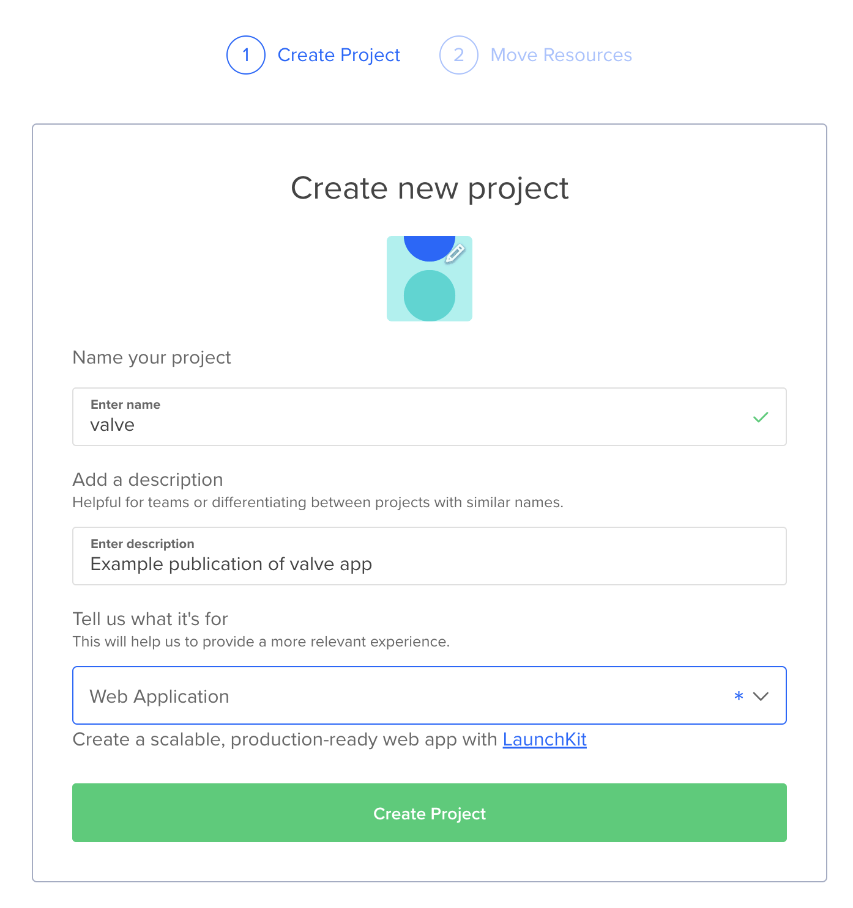
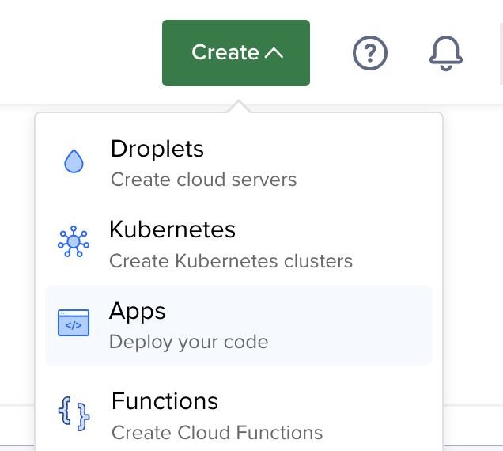
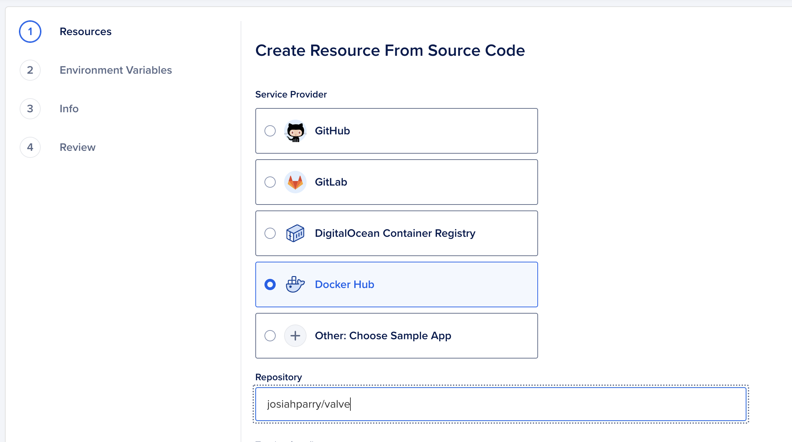
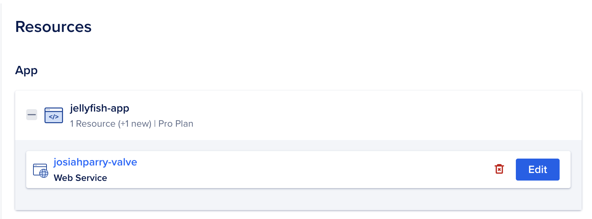
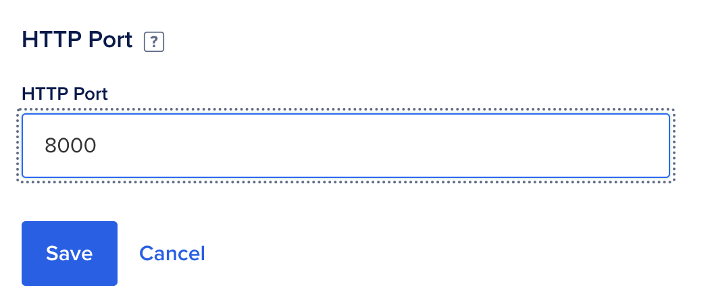
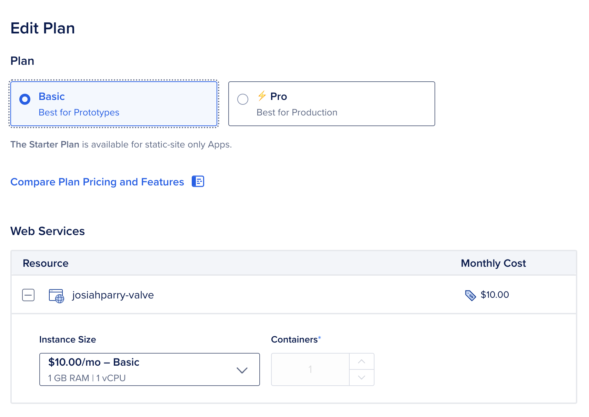

```{r, include = FALSE}
knitr::opts_chunk$set(
  collapse = TRUE,
  comment = "#>"
)
```

[DigitalOcean](https://www.digitalocean.com/) is a simple web-services hosting site. Compared to AWS, GCP, and Azure, getting a service up and running on DigitalOcean is a breeze! 

A live example of a Valve app hosted on DigitalOcean be [accessed here](https://plankton-app-ozvgy.ondigitalocean.app).

To deploy a Valve app to DigitalOcean we need first make our app into a Docker-based service. See [Using Valve with Docker](https://valve.josiahparry.com/articles/using-valve-with-docker) for creating an appropriate Dockerfile. The source code for the above example can be found in the [`/inst/docker` folder](https://github.com/JosiahParry/valve/tree/main/inst/docker).


## Building Docker Image

Always get the tough part out of the way first. In this case, that is building the Docker image. First, make sure that you have an account at [Docker Hub](https://www.hub.docker.com). Ensure that you have [Docker desktop](https://www.docker.com/products/docker-desktop/) installed—it makes the process a bit easier. 

Navigate to the directory that has your `Dockerfile`. We will build the Docker image with the following naming convention `{username}/{image-name}:{tag}`. Following this convention will make it a bit easier.

```shell
docker build -t ${USERNAME}/${IMAGE}:${VERSION} .
docker tag ${USERNAME}/${IMAGE}:${VERSION} ${USERNAME}/${IMAGE}:latest
```

In my case I ran the below to create an image under my username `josiahparry` with the image name `valve` and the tag `stable`. The `.` is important, because it tells us that we're building the Dockerfile in the current directory. Afterwards, we tag that newly built image with the `latest` tag. This build process can take a few minutes. Go fold some laundry, wash some dishses, whatever might make you feel like you're being productive during this time. 

```shell
docker build -t josiahparry/valve:stable .
docker tag josiahparry/valve:stable valve:latest
```

If you are using a Mac M1 or M2 chip / an arm-based machine, you'll need to build specifically for `amd64`. This is what I have to use for my Mac M1. 

```shell    
docker buildx build --platform=linux/amd64 -t josiahparry/valve:latest .
```

## Publishing to Docker Hub

Open Docker Desktop. From there, [sign into Docker Hub](https://docs.docker.com/desktop/get-started/#learning-center) by pressing the `Sign In` button on the top right. 


Now that you are signed in to the app, we can [publish directly to Docker Hub](https://docs.docker.com/get-started/publish-your-own-image/#step-4-push-your-image-to-docker-hub). Find the image you build in the images section. Click the three dots for more menu options. 


## Deploying with DigitalOcean

Now that you have pushed your image to Docker Hub, we can easily deploy the application using DigitalOcean. Navigate to https://cloud.digitalocean.com and create an account. 

From the cloud console we will start by creating a project.



Ensure that the project is a `Web Application`. After you have created your project, we will need to create an application inside of the project. Navigate to the `Create` button drop-down and select `App`. 



Now, choose `Docker Hub` in the `Create Resource from Source Code` menu option. Under repository, provide the name of your Docker image which follows the patter `username/image`. In my case, that is `josiahparry/valve`. You also have the option to provide a specific tag to be used. Otherwise, the `latest` tag will be used. 



Press `Next` to continue. Now we need to edit the application to use the correct port. This will be the port that is used by Valve in your `Dockerfile`. The example Dockerfile uses port `8000`, so we need to change that. 



Change the `HTTP Port` to the correct port that is used by Valve. In my case, that is 8000.



Press `Back` to continue in the process. 

Press `Edit Plan` to specify the size of the images you want to use. In my case, I want to use a smaller and cheaper one. I'd recommend to start as small as possible and monitor the behavior and CPU usage before increasing the size of your images. Don't pay for what you're not using!



After you have chosen the appropriate plan, go to `Review` and press `Create Resource`. If, you are in review and you see the option to modify your plan press `Back`. You will then be able to create your resource.

Your app will now be built and deployed! 


