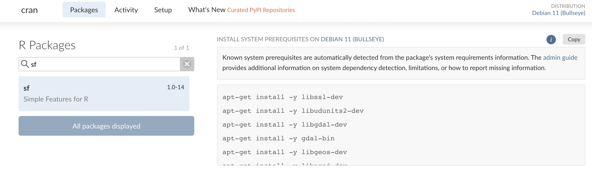

```{r, include = FALSE}
knitr::opts_chunk$set(
  collapse = TRUE,
  comment = "#>"
)
```

Valve is intended to make plumber APIs more effective in a production setting. It is recommended to deploy plumber APIs to production in a [Docker](https://www.docker.com/) container (or use [Posit Connect](https://posit.co/products/enterprise/connect/) if you have company budget and more use cases than a single API).

This document will describe two different approaches to making Dockerfiles for using valve. One using `rocker/r-ver` as the base image and the other that uses `rhub/r-minimal`. 

Both approaches have their benefits. Using `rocker/r-ver`, it is easier to identify and add system dependencies. Whereas using `rhub/r-minimal` the image is 1/10th of the size but some quality of life things such determining system dependencies and having R package binaries pre-built are not present. 

In order to keep the Docker images lightweight and as dependency free as possible, a **multi-stage build** process is used. This allows us to extract only _some_ artifacts from one image and use another as the base image. 

Broadly, the process is like so: 

1. Install `valve` using a "builder"
2. Specify our base image
3. Copy the valve binary into our image
4. Install plumber's system dependencies
5. Install R packages
6. Start valve in your `ENTRYPOINT`

## Using `rocker/r-ver`

The `rocker/r-ver` images allow you to specify a specific version of R in the tag. This should match with the version of R that you are using. Determine yours with: 

```{r}
getRversion()
```

### Rust Builder 

The first part of our Dockerfile needs to specify our builder. This will be the slim Rust default image. Inside of that image we will install valve from crates.io.

```docker
# stage 1: install valve
FROM rust:slim AS builder
RUN cargo install valve-rs --no-default-features
```
### Everything else

Once that has been completed, we can move onto the creation of our Docker image that will serve plumber APIs via Valve. Here we specify the `rocker/r-ver` image we want based on the tag (the bit that follows the colon). This should match your R-version for the best chance at reproducibility. 

Next, some environment variables for Valve to use are specified. The `VALVE_HOST` _must be_ `0.0.0.0` which is a Docker requirement. The `VALVE_PORT` can be changed. Then, the image is configured to always use RStudio Package Manager when using the [`{renv}`](https://rstudio.github.io/renv/) package which will provide us with binaries for speedy package install. 

```docker
# stage 2: configure the container to run plumber
FROM rocker/r-ver:4.3.0

ENV VALVE_HOST 0.0.0.0
ENV VALVE_PORT 8000

ENV RENV_CONFIG_REPOS_OVERRIDE https://packagemanager.rstudio.com/cran/latest
```

The next part of the `Dockerfile` contains steps to install the required system dependencies to install and run plumber APIs.

```docker
RUN apt-get update -qq && apt-get install -y --no-install-recommends \
  libcurl4-openssl-dev \
  libicu-dev \
  libsodium-dev \
  libssl-dev \
  make \
  zlib1g-dev \
  && apt-get clean
```

With the appropriate system dependencies, the R packages can be installed. First `{renv}` is installed and then `renv` is used to install package dependencies. This requires an `renv.lock` file to be found in the directory. Then the `plumber.R` file (also assumed to be in the root) is copied to `/api/plumber.R`. 

Note that if you have additional files that accompany your plumber API they also need to be copied and moved.

```docker
COPY renv.lock renv.lock
RUN Rscript -e "install.packages('renv')"
RUN Rscript -e "renv::restore()"
COPY plumber.R /api/plumber.R
```

Lastly, we copy the valve binary into our Docker image, expose the port that the API will be served on, and start the application! 

The `ENTRYPOINT` is where you have control over how Valve will scale. Most importantly, the `-f` flag should point to a `plumber.R` script—wherever that might be in your Dockerfile. The host _must_ be `0.0.0.0` for a Docker container. You can configure the additional arguments as you need. See the README for more on how these arguments work. 

```docker
# get binary from builder 
COPY --from=builder /usr/local/cargo/bin/valve /usr/local/bin/

# open the port for valve
EXPOSE ${VALVE_PORT}

# Start Valve app
ENTRYPOINT valve -f /api/plumber.R -h $VALVE_HOST -p $VALVE_PORT -w 5 -n 5 --check-unused 10 --max-age 300
```

At the end of this article, is the complete Dockerfile. 

## Using `rhub/r-minimal`

The `r-minimal` base image is extraordinarily small and is very powerful. If you are new to Docker and know little about linux, I would not recommend this approach as it does have some [limitations](https://github.com/r-hub/r-minimal#limitations) such as no PNG, Java, or X11 support among others. If, however, you have code with dependencies that do not need these, or you want to go fast, this is the approach for you.

Additionally, R packages should be installed using the small CLI tool that is included in the base image `installr`. `installr` uses [`{pak}`](https://github.com/r-lib/pak) to install packages rather than `renv`. View the [github repo](https://github.com/r-hub/r-minimal) for more on how the CLI works. One downside of this is that R packages are built from source which drastically slows down build time. 

The approach to building the Dockerfile is very similar to the `r-ver` image. First we specify the builder and install valve, then specify our base image as `rhub/r-minimal:4.3.0`. After that, we copy over the valve binary, install our system dependencies, R packages, and then configure the `ENTRYPOINT`.

```docker
FROM rust:1.71.1-alpine AS builder
RUN apk add musl-dev
RUN cargo install valve-rs --no-default-features

FROM rhub/r-minimal:4.3.1

# Copy the binary from the builder stage
COPY --from=builder /usr/local/cargo/bin/valve /usr/local/bin/

# Install additional packages and perform other setup steps
RUN apk add --no-cache --update-cache \
        --repository http://nl.alpinelinux.org/alpine/v3.11/main \
        autoconf=2.69-r2 \
        automake=1.16.1-r0 && \
    installr -d \
        -t "libsodium-dev curl-dev linux-headers autoconf automake" \
        -a libsodium \
        plumber

EXPOSE 8000
COPY plumber.R /api/plumber.R

# Start Valve app
ENTRYPOINT valve -f /api/plumber.R -h 0.0.0.0 -p 8000 --workers 10 --n-max 10 --check-unused 10 --max-age 300
```

## Complete `rhub/r-ver` `Dockerfile`

```{r, echo = FALSE}
cat(readLines(system.file("docker/Dockerfile", package = "valve")), sep = "\n")
```
The above Dockerfile is included in `{valve}` and can be found via `system.file("docker/Dockerfile", package = "valve")`. It was built with the included plumber API `system.file("docker/plumber.R", package = "valve")`.

To replicate, copy the files into a directory of your choosing. Ensure Docker desktop is open. Then build the container with `docker build -t valve:latest .`. Then you can run the container with: 

```shell
docker run -p 8000:8000 valve:latest
```

## Addenda 

### Determining System Dependencies 

One of the challenges in building Docker images is knowing what system dependencies you need to include in your build. The easiest and interactive way to determine what dependencies you need in your build is to visit [Posit Package Manager](https://packagemanager.posit.co/client/#/repos/2/). For each package you can scroll down to `Install System Prerequisites on {Distro}` section. 



This enumerates all of the system dependencies that you need to install on your machine before the package can be installed. The instructions show one install command per dependency but it can typically be simplified into a single command by separating the libraries with a space. For example installing the first few deps can be simplified as:

```shell
apt-get install -y libssl-dev libudunits2-dev libgdal-dev
```

Alternatively, if you want to do this more programmatically, you can do so using `pak` which is honestly the way that I prefer to do it!

```{r}
pak::pkg_system_requirements("sf", "ubuntu", "22.04")
```

### A note on number of workers

It is pretty tough to estimate the total number of worker threads available on a system. Right now, there is no check in place to see if your number of workers and connections exceeds the total number of threads available. If it does, there is a chance that calls to your Valve app may error out since there is thread contention. In general, its a good idea to only ask for what you need. For the smallest DigitalOcean compute, you should not exceed 3 workers and connections. Consult docs to see how many threads are available. 
